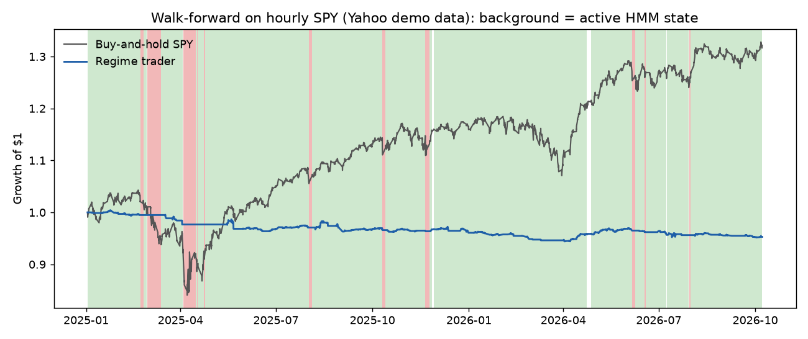
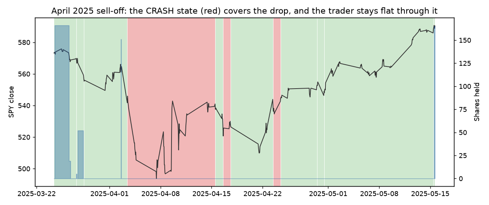
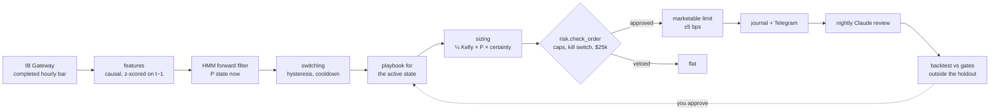

# Regime Trader: HMM States, Per-Regime Playbooks, Hard Limits in Code

[](https://github.com/vincal848/regime-trader/actions/workflows/ci.yml)

This project started from a prompt I found online for an "AI regime trader".
The prompt described:

- a Gaussian hidden Markov model reading the market state every hour;
- Claude researching one playbook per state;
- deterministic code making every trade;
- a nightly self-improvement loop;
- Telegram alerts;
- a list of backtest gates the strategy had to clear before trading real
  money: Sharpe above 1.5, drawdown under 15%, a hit rate over 55%, and
  beating buy-and-hold.

I wanted to see what building it properly would actually take, so I built
it against an Interactive Brokers paper account, test-first, from a written
spec ([docs/SPEC.md](docs/SPEC.md)).

Two things came out of that. The first is that the system works end to end,
from IB Gateway bars to orders, a journal, a dashboard and a nightly Claude
review. The second is that, on the data I have, the strategy as specified
does **not** clear its own gates. The defects that mattered most only showed
up on real data, and each one still produced plausible-looking output:

- a labelling quirk meant the first walk-forward never placed a trade in 21
  months;
- the live loop silently dropped its regime at every monthly refit, which
  the backtest never did.



## At a glance

| | |
|---|---|
| **Market** | SPY, hourly regular-hours bars, long/flat only, IBKR **paper** account |
| **State model** | Gaussian HMM with full covariances; K chosen by out-of-sample likelihood; states labelled CALM_UP, CHOP, STRESS or CRASH from their return and volatility |
| **Decisions** | Forward-filtered probabilities only; switching with hysteresis, cooldown and an early stress cut |
| **Sizing** | min(¼ Kelly, state cap) × P(state) × (1 − entropy), falling back to ¼ of the cap until calibration is shown out of sample |
| **Hard limits** | 2% daily loss, 10% drawdown kill switch, state caps, $25,000 manual approval, flat on stale data, disconnects or errors |
| **Research loop** | Nightly Claude (Opus 5.5) review under a monthly spend cap; proposals backtested outside a 12-month locked holdout, never auto-applied |
| **Validation** | 245 tests at 95% coverage, `mypy --strict`, a future-perturbation test, an architecture test |
| **Result** | Demo walk-forward Sharpe **−0.96** against buy-and-hold's **1.08**: the gates fail |
| **Stack** | Python, NumPy, pandas, SciPy, hmmlearn, ib_async, Anthropic SDK, Streamlit |

The backtest and the live trader call the same `engine.decide`, and they
install each refit the same way (`refit.adopt_fit`). That is the point of
the architecture. Most failures of this kind of system are differences
between what was tested and what trades, so the design leaves no room for
one.

## Results

Every number below is produced by
[`scripts/demo_walkforward.py`](scripts/demo_walkforward.py). The script
regenerates [docs/DEMO_RESULTS.md](docs/DEMO_RESULTS.md) and the figures
here, so the documentation cannot drift away from the code. The data is
Yahoo hourly SPY, 2023-11 to 2026-10, walked forward from 2025-01-02 with
monthly refits.

**This is a demo, not the acceptance test.** Yahoo's free hourly history is
too short for the spec's fit from 2018 with a 12-month locked holdout. That
run needs IBKR data.

**Acceptance gates**, out of sample and after costs (IBKR tiered
commission, 1 bp of slippage, half a cent of spread):

| Metric | Regime trader | Gate | |
|---|---|---|---|
| Sharpe (daily, ×√252) | −0.96 | > 1.5 | ✗ |
| Max drawdown | 6.0% | < 15% | ✓ |
| Hit rate (per trade) | 35.6% | > 55% | ✗ |
| t-statistic | −1.28 | > 2.0 | ✗ |
| Beats buy-and-hold (Sharpe 1.08) | no | yes | ✗ |
| Beats best static strategy (CALM_UP, Sharpe 0.11) | no | yes | ✗ |

The drawdown gate passes only because the system was small and often flat.
Following the spec, the gates were not loosened.

**Where the time and the losses went:**

| State | Bars active | Share | Trades | P&L ($) |
|---|---|---|---|---|
| CALM_UP_1 | 1,329 | 43.3% | 53 | −1,283 |
| CALM_UP_2 | 1,533 | 50.0% | 65 | −3,425 |
| CRASH | 200 | 6.5% | 0 | 0 |

Every refit chose K = 3: two shades of calm and one violent state. The CHOP
and STRESS playbooks never traded. The CALM_UP entry rule enters on a
momentum burst, and it won only 36% of the time after paying about 2 bps a
round trip. Buy-and-hold made more by sitting through the same calm
periods.

**Calibration.** Only 6 of 22 refits judged the previous fit's one-bar-ahead
state predictions better than climatology. So for most of the run, sizing
used the fixed quarter-cap fallback rather than the model's probabilities.
That gate is the reason the losses stayed small.



*The April 2025 sell-off. The model classed the whole drop as CRASH (red),
whose cap is zero, so the trader held nothing through it. The losses in the
table above all came from the calm states' playbook, not from this
episode.*

## How it works



**Features.** Five per bar: return, 21-bar realized volatility, high-low
range, volume against the same hour's 20-session median, and trend against a
70-bar EMA. Each is z-scored on statistics through t − 1 only, and needs 20
sessions of warm-up.

**State.** hmmlearn fits the parameters, with 10 restarts. Decisions then
run through this repository's own log-space forward filter, which caches
each state's Cholesky factor once per fit. The labels come from each state's
probability-weighted return and volatility, and a Hungarian assignment keeps
them stable across refits.

**Switching.**
- A state takes over only above 70% probability, after leading for 3 bars.
- A 7-bar cooldown follows each switch.
- Size halves when the next bar's stress-or-crash probability exceeds 25%.
- Size goes to zero when the top two states are within 0.15 of each other.

**Risk.** `risk.py` imports nothing but the bar schema, so no model can
reach it.
- Its kill switch fires on a 10% drawdown, 3 consecutive rejects, or 300 s
  disconnected.
- It is sticky: it survives restarts until you reset it.
- Reducing risk never waits for approval.

**Research loop.** Each night the day's record goes to Claude inside
`<record>` tags, as data.
- Proposed playbooks come back as tagged files, and are parsed with the
  same whitelisted grammar as the real ones.
- Each one is backtested against the gates. Every candidate tested is
  counted, so repeated tweaking stays visible.
- Nothing is applied. A passing candidate waits for a human commit.

## Decisions

- **Forward filter only, enforced rather than promised.** Smoothed and
  Viterbi inference use future bars, so an AST test bans `predict_proba`,
  `predict`, `decode` and `score_samples` everywhere except the offline
  calibration module (`test_smoothed_or_viterbi_inference_is_confined_to_calibration`).
  A future-perturbation test changes every later bar and checks that no
  earlier decision moves (`test_no_decision_depends_on_a_future_bar`).
- **A locked holdout, deliberately deviating from the prompt.** The prompt
  re-ran the same backtest after every nightly tweak. That turns the gates
  into a fitting target. The most recent 12 months are kept out of every
  development loop (`test_the_holdout_is_locked_unless_explicitly_requested`).
- **Numbered states share their base playbook.** When the model finds two
  calm states, they are labelled `CALM_UP_1` and `CALM_UP_2`. Playbooks
  were looked up by exact label, so the first demo run made **0 trades in
  21 months** and still produced a clean-looking report. Now one rule maps a
  label to its base state everywhere a label meets a playbook or a cap
  (`test_a_numbered_state_trades_its_base_playbook`).
- **Calibration gates sizing.** A first fit sizes at a quarter of the cap.
  Only a refit that scores the previous fit out of sample, matching states
  by label rather than index, unlocks probability-weighted sizing
  (`test_an_uncalibrated_fit_sizes_at_a_quarter_of_the_cap`).
- **One way to install a refit.** Live used to reset its switching state on
  each refit, so after every monthly refit it went flat for at least 3 bars
  and closed whatever it held. The backtest never did, so it overstated
  live results. Both loops now call `adopt_fit`
  (`test_a_refit_does_not_close_the_position_live`).
- **Models advise; code decides.** `risk.py` imports only the bar schema
  (`test_risk_depends_on_nothing_but_bars`). Journal text reaches Claude
  only as data (`test_the_record_carries_journal_text_as_data`), and
  proposals are filed, never applied
  (`test_nightly_backtests_proposals_but_never_applies_them`).
- **Paper only by construction, not by a flag.** The account must start
  with `DU`, the live ports 4001 and 7496 are refused, and a session that
  can see a live account disconnects
  (`test_connecting_to_a_live_account_is_refused`). Going live would mean
  changing tested code.
- **Marketable limits, not market orders.** Every order is capped 5 bps
  through the reference price, so a thin moment or a reopening auction
  can't fill far away. An order that doesn't fill within a bar is cancelled
  and counted as a reject.

## Quick start

```bash
pip install -e ".[dev,demo]"
pytest -q                       # 245 tests
```

The demo needs no broker:

```bash
mkdir demo && cp -r playbooks demo/
regime-trader --root demo fetch --source yahoo
regime-trader --root demo backtest --test-start 2025-01-02 --no-holdout
```

```
Walk-forward from 2025-01-02 (no locked holdout: demo only)
Sharpe -0.96 | max drawdown 6.0% | hit rate 35.6% | t-statistic -1.28 | total return -4.7% | trades 118
Baselines (Sharpe): buy-and-hold 1.08, static CALM_UP 0.11
Gates: FAILED
  [ ] sharpe
  [x] max_drawdown
  [ ] hit_rate
  [ ] t_statistic
  [ ] beats buy-and-hold
  [ ] beats static CALM_UP
```

The command exits with code 1 when the gates fail. That is a result, not an
error.

Paper trading. The full Windows setup (IB Gateway under IBC, an NSSM
service, scheduled jobs, power settings) is in
[docs/DEPLOY_WINDOWS.md](docs/DEPLOY_WINDOWS.md).

```bash
regime-trader fetch                  # hourly bars from IB Gateway
regime-trader fit                    # fit or refit; prints drift and calibration
regime-trader backtest               # walk-forward against the gates, holdout locked
regime-trader live                   # the paper trader
regime-trader kill [--reset]         # sticky kill switch
regime-trader approve --minutes 60   # let orders over $25,000 through
regime-trader nightly                # daily report, Claude review, proposal backtests
regime-trader dashboard
```

Reproduce the documentation:

```bash
pytest -q && ruff check . && mypy
python scripts/demo_walkforward.py demo 2025-01-02   # docs/DEMO_RESULTS.md and docs/img/
```

## Repository guide

| Path | Contents |
|---|---|
| `src/regime_trader/` | 21 modules in five layers. A module may import only from its own layer or lower ones |
| ↳ core | `bars`, `features`, `hmm`, `switching`, `playbook`, `sizing`, `risk`, `metrics`: pure, no I/O |
| ↳ engine | `engine`: one bar in, one decision out |
| ↳ research | `refit`, `backtest`, `calibration`: the fit bundle, walk-forward, gates, drift |
| ↳ adapters | `store`, `ibkr`, `yahoo`, `alerts`, `llm`: all I/O |
| ↳ apps | `live`, `nightly`, `dashboard`, `cli` |
| `playbooks/` | One Markdown playbook per state: a TOML block in a whitelisted condition grammar |
| `tests/` | 245 tests, including architecture, future-perturbation and fake-broker live tests |
| `scripts/demo_walkforward.py` | Regenerates `docs/DEMO_RESULTS.md` and `docs/img/` |
| `docs/SPEC.md` | What the system must do, the decisions made, and where it deviates from the prompt |
| `docs/ARCHITECTURE.md` | Layers, module contracts, state on disk |
| `docs/PLAN.md` | The 11-step build plan, tests first |
| `docs/DEMO.md` | The demo run and what it shows |
| `docs/GO_LIVE.md` | The go-live checklist and "WHAT COULD BLOW UP THIS ACCOUNT?" |
| `docs/DEPLOY_WINDOWS.md` | Running it unattended on a Windows PC |
| `CHANGELOG.md` | Every step: tests first, then the implementation, then the defects found |

## Future interests

- **The real acceptance run.** IBKR hourly history from 2018, walk-forward
  from 2021, scored once on the locked holdout. Everything here is built for
  it; it needs the data.
- **A CALM_UP playbook that holds through the state** instead of trading
  momentum bursts. The demo suggests the regime label carries the
  information, while the entry trigger mostly adds costs.
- **A volatility-only feature set**, to see whether CHOP and STRESS appear
  once trend stops dominating the state split.
- **Sharing refits across proposal backtests.** The HMM refits don't depend
  on the playbooks, so each nightly candidate could reuse them. This is the
  largest speed-up available at real scale.
- **Shorts in CRASH**, behind their own gates. Long/flat was a deliberate
  first decision.
- **A small always-on VPS** instead of a home PC, which removes the power
  and home-internet risks listed in GO_LIVE.md.

## Notes

- **References.**
  - Hamilton (1989) on regime-switching models.
  - Rabiner (1989) on HMM inference: the forward algorithm, and why
    smoothing looks ahead.
  - Kelly (1956) and Thorp on fractional Kelly sizing.
  - Bailey, Borwein, López de Prado and Zhu on backtest overfitting, which
    is the reason for the locked holdout and the trial counter.
- **Conventions.**
  - Bars are IBKR regular-hours hourly bars, 7 a day (09:30–10:00, then on
    the hour), New York time, timestamped at the start.
  - Sharpe and the t-statistic use daily returns, annualized by √252.
  - The hit rate is per round-trip trade.
- No market data is committed. Bars, the journal, fitted models and
  proposals live in gitignored folders. Secrets (the Telegram token and the
  Anthropic key) live in `.env` only, and IBKR needs no API key.
- Not investment advice. This system trades a paper account, and
  [docs/GO_LIVE.md](docs/GO_LIVE.md) explains why it is not ready for
  anything else.

## License

MIT © 2026 Caleb Vinson
